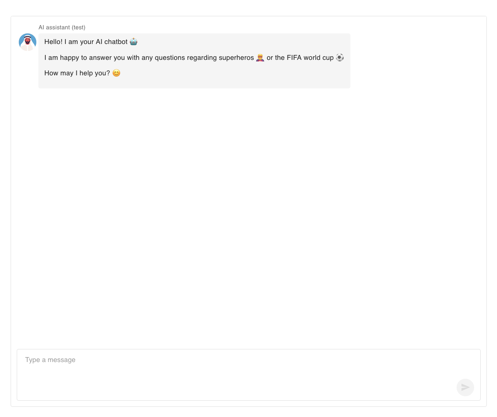
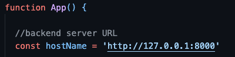

# FastAPI AI chatbot

I have created a very simple AI chatbot with Google Gemini AI Studio API, that can only answer questions about superheros and the FIFA world cup. You can run it on a local server without a user interface as well as with a user interface.

This project is part of an assessment for an AI software engineer position at [Applab](https://applab.qa/)

## Tech Stack:

  - FastAPI
  - React
  - Material UI
  - Google Gemini AI Studio

## Run the server locally

  1. Clone the respiratory:

 ```
 git clone https://github.com/Khaled-Abdalhadi/ai-engineer-assessment-Khaled-Abdalhadi.git
 ```

  2. Navigate to the backend directory:

  ```
  cd backend
  ```

  3. Create a virtual environment:

  ```
  python -m venv .venv
  ```

  4. Activate the virtual environment:

  ```
  source .venv/bin/activate
  ```

  5. Install the project dependencies:

  ```
  pip install -r requirements.txt
  ```

  6. Start the backend server:

  ```
  uvicorn main:app --reload
  ```

  7. Test the `/ask` endpoint

  You can test that the backend is running correctly by sending a `POST` request to the `/ask` endpoint.

  ```
  curl -X POST \
    "{HOST}/ask" \
    -H "accept: application/json" \
    -H "Content-Type: application/json" \
    -d '"<your prompt here>"'
  ```

  **Example:**

  ```
  curl -X POST \
    "http://127.0.0.1:8000/ask" \
    -H "accept: application/json" \
    -H "Content-Type: application/json" \
    -d '"What can you tell me about the 2022 FIFA world cup?"'
  ```

  If the server is running successfully, you should recieve a JSON response containing the model's response.

  **Example:**
  
```
{
  "message": "The 2022 FIFA World Cup, hosted by Qatar, featured 32 teams competing in a total of 64 matches. Argentina emerged as the champion after defeating runner-up France, while Kylian Mbappé secured the Golden Boot as the top scorer with eight goals. The tournament recorded a total attendance of 3,404,252 spectators, resulting in an average attendance of 53,191 fans per match.",
  "source": "Football - FIFA World Cup, 1930 - 2026",
  "source_url": "https://www.kaggle.com/datasets/piterfm/fifa-football-world-cup?resource=download&select=world_cup.csv"
}
```
  

## Running the bot with a user interface

Once you have a server running locally, follow the steps below if you want to test the chatbot with a user inferface.

  1. Navigate to the frontend directory:

  ```
  cd frontend
  ```

  2. Install dependencies:

  ```
  npm install
  ```

3. Start the development server:

```
npm run dev
```

4. open your browser and go to: `http://<host-name>`. 

**Example:**
`http://localhost:5173`

You should see the chatbot interface



5. If you run into any issues while sending messages to your backend API, make sure the constant `hostName`  in `the App.tsx` matches your actual backend host name.

**Example:**



   
## References:

   - [Gemini API Documentation](https://ai.google.dev/gemini-api/docs)
   - [FastAPI Documentation](https://fastapi.tiangolo.com/tutorial/first-steps/)
   - [FIFA World Cup 1930-2022 data](https://www.kaggle.com/datasets/piterfm/fifa-football-world-cup?resource=download&select=world_cup.csv)
   - [Analyzing PDFs and CSV](https://geminibyexample.com/016-pdf-csv-analysis/)
